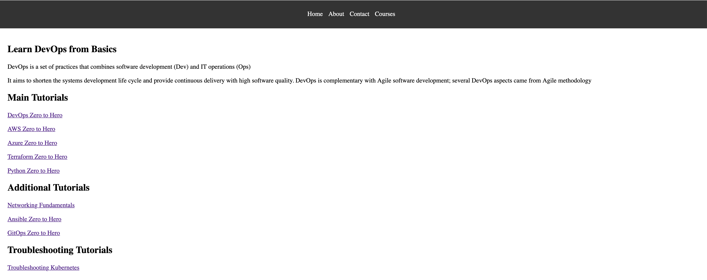

# Go Web Application

This is a simple website written in Golang. It uses the `net/http` package to serve HTTP requests.

## Running the server

To run the server, execute the following command:

```bash
go run main.go
```

The server will start on port 8080. You can access it by navigating to `http://localhost:8080/courses` in your web browser.

## Looks like this




# Let's deployment the application
## 1. Using EKS

### Write a Dockerfile for the go-web application

### Let's containerise the application

```cli
docker built -t rivadias/go-web-app:v1 .

docker run -p 8080:8080 -it rivadias/go-web-app:v1

docker push rivadias/go-web-app:v1

```

### Let's create a manifest files: deployment, service, ingress


### Let's connect AWS inorder to create a EKS cluster and deploy the application

```cli
aws configure
```

```cli
eksctl create cluster --name demo-cluster --region us-east-1
```

```cli
kubectl apply -f k8s/manifests/deployment.yaml
kubectl apply -f k8s/manifests/service.yaml
kubectl apply -f k8s/manifests/ingress.yaml
```

```cli
kubectl get all
```

```cli
kubectl edit svc  nameofservice -(edit it to NodePort)

kubectl get svc

kubectl get nodes -o wide
```

select one node external IP, open inn new tab-- ipaddress:port/courses


### let's create a ingress controller

```cli
kubectl apply -f https://raw.githubusercontent.com/kubernetes/ingress-nginx/controller-v1.12.2/deploy/static/provider/aws/deploy.yaml
```

```cli
kubectl get pods -n ingress-nginx

kubectl get ingress
```

let's do a mapping of address

nslookup LB_address

sudo vim /etc/hosts

ip_address go-web-app.local
on  new tab -  go-web-app.local/homme


## 2. Using Helm Configuration
  
pre-requisite: helm should be installed

```cli
helm version

helm create go-web-app-chart
```

copy all the manifest used previously into templates folder, create values.yaml file

delete all the previous deployment

```cli

helm install go-web-app ./go-web-app-chart

kubectl get deployment

kubectl get svc

kubectl edit deploy go-web-app
```

helm uninstall go-web-app


## 3. CI/CD using GitHub Action and ArgoCD

create a pipeline using GitHub Action, 

Adding Secrets ........

For deployment we need to install ArgoCD

```cli
kubectl create namespace argocd

kubectl apply -n argocd -f https://raw.githubusercontent.com/argoproj/argo-cd/stable/manifests/install.yaml
```
Access ArgoCD UI(Loadbalanvcer Service)
```cli
kubectl patch svc argocd-server -n argocd -p '{"spec": {"type": "LoadBalancer"}}'
```

```cli
kubectl get  svc -n argocd
or
kubectl get nodes -o wide
```
New tab- externalip-address:port-of-argocdservice

To get password for ArgoCD- 
``cli
kubectl get secrets -n argocd
kubectl edit secret argocd-initial-admin-secret -n argocd

echo thepassword_string | base64 --decode
```
Add the cluster to Argocd


```cli
kubectl get deploy
kubectl get svc
kubectl get ing
```

access it on go-web-app.local/courses
